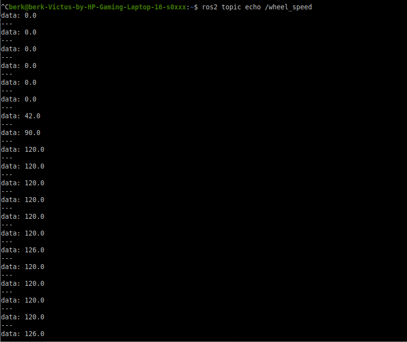

[Türkçe](#türkçe) | [English](#english)

---

## Türkçe

# STM32 micro-ROS Enkoder Hız Yayınlayıcı

Bu projede **STM32F446RE** mikrodenetleyicisi kullanılarak optik enkoder üzerinden DC motor hızının (RPM) ölçülmesi, ölçülen hızın **hareketli ortalama filtresi** ile stabilize edilmesi ve işlenen verinin **micro-ROS** aracılığıyla **ROS 2** ortamına yayınlanması gerçekleştirilmiştir.

Sistem, robotik uygulamalarda tekerlek hızı geri bildirimi ve odometri altyapısı oluşturmak amacıyla tasarlanmıştır.

## Encoder ve Filtre Parametreleri Özeti

| Parametre                    | Değer             | Açıklama |
|-----------------------------|-------------------|----------|
| Enkoder Tipi                | Optik, tek kanal  | Yükselen kenar sayımı |
| Disk Delik Sayısı           | 20                | 1 turdaki darbe sayısı |
| Timer                       | TIM2              | 32-bit donanımsal sayaç |
| Timer Modu                  | External Clock 1  | Harici darbe ile sayım |
| Sayaç Çözünürlüğü           | 32-bit            | 0 – 4.294.967.295 |
| Örnekleme Periyodu          | 100 ms            | 10 Hz hız hesaplama |
| Hız Birimi                  | RPM               | Dakikadaki devir sayısı |
| Ham Hız Hesabı              | ΔCount / 20 × 600 | Darbe → RPM dönüşümü |
| Filtre Tipi                 | Hareketli Ortalama| Moving Average |
| Filtre Pencere Boyutu (N)   | 5                 | Son 5 ölçüm |
| Filtre Yapısı               | FIFO (Dairesel)   | Dairesel tampon |
| Yayınlanan Topic            | `/wheel_speed`    | micro-ROS publisher |
| Mesaj Tipi                  | `std_msgs/Float32`| ROS 2 uyumlu |

## Teknik Doküman
- [Enkoder hız hesaplama ve filtreleme teknik notu](Docs/Encoder_Teknik_Not.pdf)

## Sistem Testi

## Kullanılan Donanım
- STM32F446RE
- Optik enkoder (20 delik)
- DC motor

- ---

## English

# STM32 micro-ROS Encoder Speed Publisher

This project demonstrates motor speed (RPM) measurement using an optical encoder on an **STM32F446RE**, stabilization of the measured speed via a **moving average filter**, and publishing the processed data to a **ROS 2** environment using **micro-ROS**.

The system is designed for wheel speed feedback in robotic applications such as odometry and low-level motor control.

## Encoder and Filter Parameters Summary

| Parameter                    | Value             | Description |
|-----------------------------|-------------------|-------------|
| Encoder Type                | Optical, single-channel | Rising edge counting |
| Encoder Disk Holes          | 20                | Pulses per revolution |
| Timer                       | TIM2              | 32-bit hardware counter |
| Timer Mode                  | External Clock 1  | External pulse counting |
| Counter Resolution          | 32-bit            | 0 – 4,294,967,295 |
| Sampling Period             | 100 ms            | 10 Hz speed computation |
| Speed Unit                  | RPM               | Revolutions per minute |
| Raw Speed Calculation       | ΔCount / 20 × 600 | Pulse-to-RPM conversion |
| Filter Type                 | Moving Average    | Moving average filter |
| Filter Window Size (N)      | 5                 | Last 5 measurements |
| Filter Structure            | FIFO (Circular)   | Circular buffer |
| Published Topic             | `/wheel_speed`    | micro-ROS publisher |
| Message Type                | `std_msgs/Float32` | ROS 2 compatible |

## Technical Documentation
- [Encoder speed calculation and filtering technical note](Docs/Encoder_Teknik_Not.pdf)

## System Test

## Hardware Used
- STM32F446RE
- Optical encoder (20-hole disk)
- DC motor

